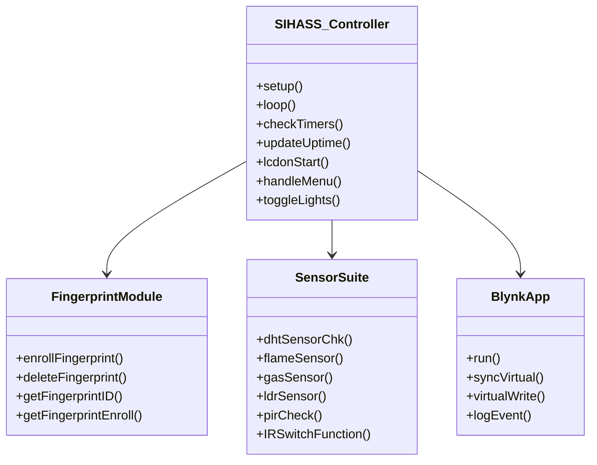
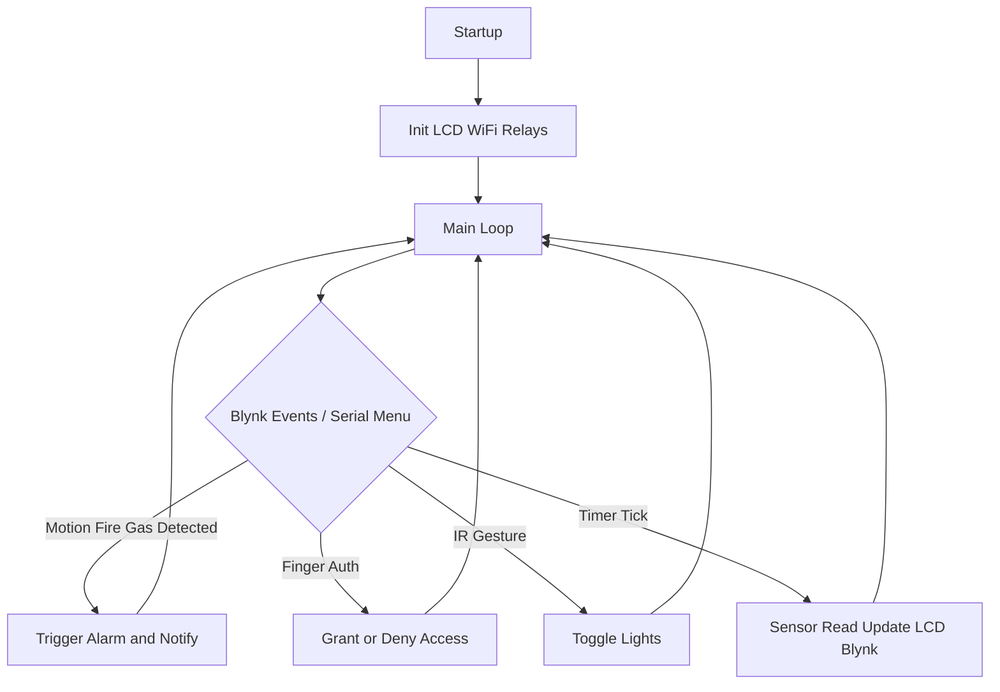
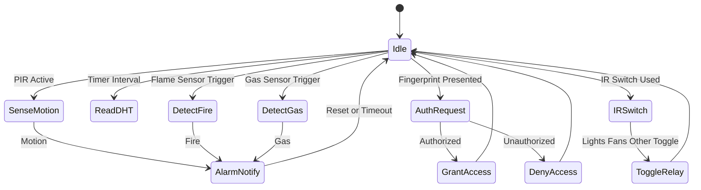

# Smart IoT Home Automation and Security Suite (SIHASS)

## Abstract

This project delivers a robust and scalable solution for next-generation home automation and security, integrating real-time monitoring, environmental sensing, cloud-enabled automation, and multi-modal user access control. SIHASS combines an ESP8266 with fingerprint authentication, a relay-driven actuator platform (lighting, fan, AC), flame/gas/PIR sensors, gesture-based IR toggling, and a visually rich LCD dashboard. Local events like fire, gas leaks, theft/motion are detected instantly and trigger audible, visual, and cloud notifications through Blynk. The system is highly modular—supporting multiple sensors per type, fast admin menu controls, and cloud/mobile feedback, making it fit for both smart home enthusiasts and small facility security automation. Advanced features include auto lockout after fingerprint failures, buzzer/lcd alarm choreography, scheduling, and environmental comfort management for safer, smarter living spaces.

---

## Hardware Components

- **ESP8266 MCU**
- **Relay Module w/ PCF8574 (I2C)**
- **LCD Display (I2C)**
- **DHT Temperature/Humidity Sensor**
- **Flame and Gas Sensors**
- **PIR Motion Sensor**
- **IR Gesture Switch**
- **Buzzer**
- **LED indicators**
- **Adafruit Fingerprint Sensor (security)**
- **Push-buttons, resistors, wiring**

---

## Features

- Smartphone app (Blynk) for toggle, monitoring, flow/warnings, fingerprints
- Real-time environmental and security event alerts (Fire, Gas, Motion, etc.)
- IR gesture switch, relay-based smart lighting/fan/AC control
- Menu-driven admin functions over serial for configuration, fingerprint enroll/delete, status
- Safety interlocking and alarm with visual/audible (LCD, buzzer, backlight)
- Modular and extendable for more rooms/zones/actuators

---

## UML Class Diagram

## FLowchart

---

## State Diagram

---
